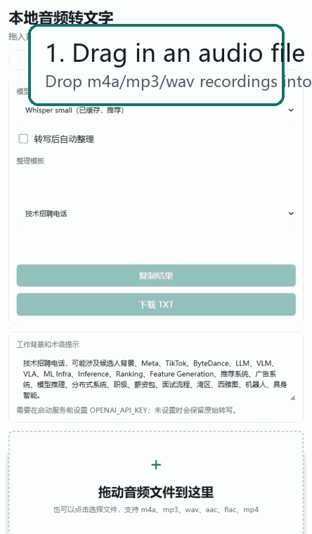
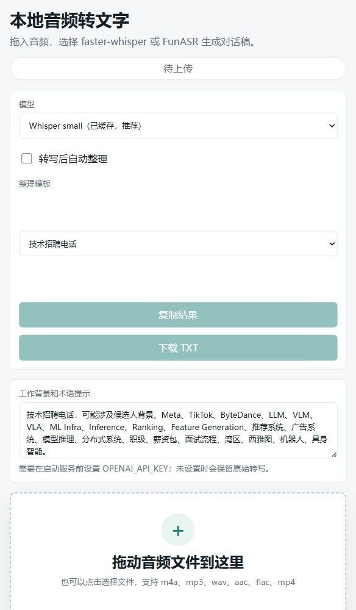

# Local Audio Transcriber

Turn recruiter calls, technical conversations, and meeting recordings into readable Chinese transcripts and structured notes, locally from a drag-and-drop web page.



## What It Solves

Audio notes are messy. Technical recruiting calls are worse: half Chinese, half English, full of model names, company names, levels, compensation, locations, and half-finished sentences.

Local Audio Transcriber helps you:

- Drop in an audio file and get a dialogue-style transcript.
- Choose between `faster-whisper` and `FunASR Paraformer`.
- See upload and transcription status instead of waiting blindly.
- Optionally send the transcript to an organizer model for cleanup, speaker-friendly formatting, and recruiting-call summaries.
- Keep raw audio, uploads, model caches, and generated outputs out of Git.

## Screenshot



## Best For

- Technical recruiter phone screens
- Candidate background calls
- JD or role-intake calls
- AI / ML / infra interview prep notes
- Chinese and mixed Chinese-English technical conversations
- Personal local transcription workflows

## Key Features

- Drag-and-drop audio upload
- Model picker: Whisper `tiny/base/small/medium/large-v3` or FunASR Chinese Paraformer
- Dialogue-style output with approximate speaker labels
- Optional organizer step: local Ollama / Qwen or OpenAI API
- Recruiting-call template with editable domain context and terminology
- Copy result and download TXT
- Local-only uploaded files and generated outputs

## Quick Start

```powershell
.\whisper_web_app\start.ps1
```

Then open:

```text
http://127.0.0.1:8787
```

## Optional Organizer Model

The organizer step cleans up the raw transcript and can produce structured recruiting notes.

### Local Ollama / Qwen

Recommended for private local workflows:

```powershell
# Install Ollama first from https://ollama.com/download
ollama pull qwen2.5:7b-instruct
ollama serve
```

Then start the app:

```powershell
$env:OLLAMA_ORGANIZER_MODEL="qwen2.5:7b-instruct"
$env:OLLAMA_URL="http://127.0.0.1:11434"
.\whisper_web_app\start.ps1
```

In the UI, choose:

```text
Organizer engine: Local Ollama
Organizer model: qwen2.5:7b-instruct
```

### OpenAI API

Recommended when you want stronger cleanup and summarization quality:

```powershell
$env:OPENAI_API_KEY="your_api_key"
$env:OPENAI_ORGANIZER_MODEL="gpt-4o-mini"
.\whisper_web_app\start.ps1
```

If neither Ollama nor `OPENAI_API_KEY` is available, transcription still works. The UI will keep the original transcript and show that the organizer step was skipped or failed.

## How The Pipeline Works

```text
Audio file
  -> faster-whisper or FunASR
  -> dialogue formatter
  -> optional organizer model
  -> transcript / notes / TXT download
```

## Local Dependency Notes

FunASR dependencies are expected at:

```text
D:\codex_python_deps\funasr
```

FunASR / ModelScope model cache is expected at:

```text
D:\modelscope_cache
```

These paths keep large model files out of the repository and away from small system drives.

## Privacy And Git Hygiene

The repository ignores:

- Uploaded audio
- Generated transcripts
- Raw segment JSON files
- Test audio
- Python cache files
- Local virtual environments

That means the app code can be versioned without accidentally publishing private calls or large model artifacts.

## Current Limitations

- Speaker labels are heuristic, not true voice diarization.
- FunASR progress is coarser than Whisper progress.
- Local organizer mode requires Ollama and the selected local model to be installed.
- The included demo GIF is a UI walkthrough, not a bundled sample recording.
